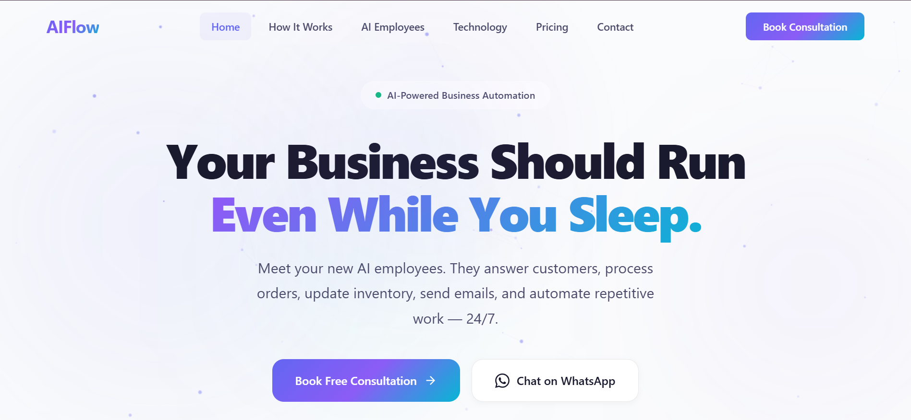
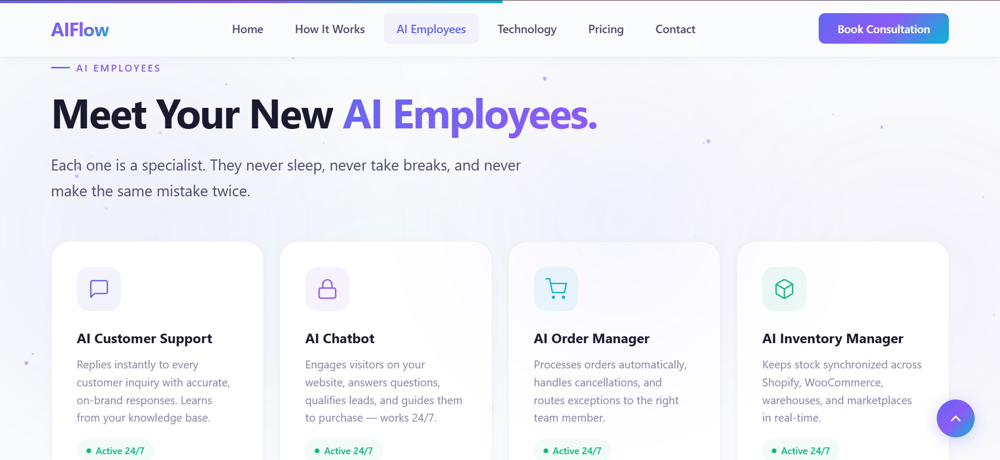
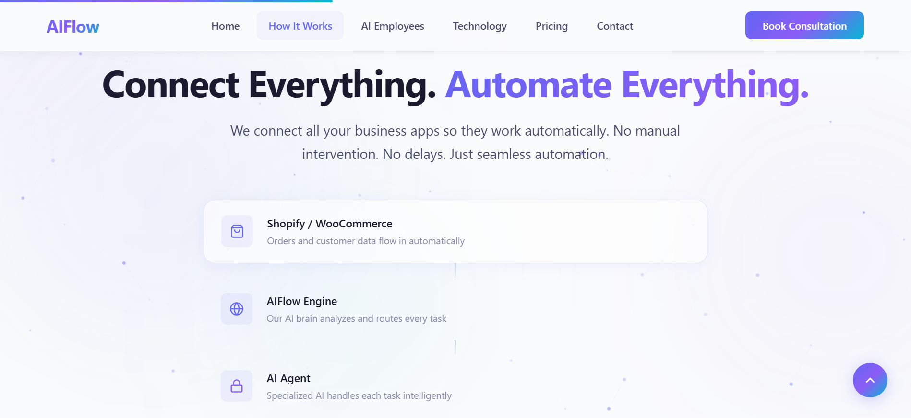

<div align="center">
  <h1>AIFlow — AI Business Automation</h1>
  <p><strong>A highly optimized, high-performance landing page for AI-driven business automation solutions.</strong></p>
  
  [](https://opensource.org/licenses/MIT)
  [](https://developer.mozilla.org/en-US/docs/Web/Guide/HTML/HTML5)
  [](https://developer.mozilla.org/en-US/docs/Web/CSS)
  [](https://developer.mozilla.org/en-US/docs/Web/JavaScript)
</div>

<br />

## Overview

AIFlow provides AI-powered employees that run critical e-commerce and business operations around the clock. This project houses the primary marketing landing page, designed from the ground up for maximum conversion, visual impact, and performance. 

The architecture completely separates structural markup, styling, and interactivity, resulting in a maintainable, extensible frontend that loads instantly without requiring a complex build pipeline.

## Features

- **Interactive Aurora & Particle Visuals:** A dynamic, physics-based particle canvas and soft aurora gradient background create a premium aesthetic.
- **Scroll-Triggered Animations:** Elements fade in and reveal based on intersection observers, keeping the user engaged as they scroll.
- **Workflow Demonstrations:** The "Hero" and "How It Works" sections utilize custom SVG icon chains and CSS-driven sequence animations to visualize complex AI operations simply.
- **Orbit Technology Diagram:** An interactive circular orbit layout demonstrating the core integrations (n8n, OpenAI, Claude, Gemini).
- **Responsive Architecture:** Fully fluid layout adapting seamlessly from large desktop displays down to mobile devices.
- **Custom Cursor & Scroll Progress:** Enhanced interactivity with a subtle custom cursor glow and a dynamic top-edge scroll progress indicator.

## Screenshots

<div align="center">
  
  <p><em>The hero section highlighting the primary value proposition. (Replace with actual screenshot)</em></p>
</div>

<div align="center">
  
  <p><em>The AI Employees grid demonstrating specialized use cases. (Replace with actual screenshot)</em></p>
</div>

<div align="center">
  
  <p><em>The horizontal 'How It Works' automation flowchart. (Replace with actual screenshot)</em></p>
</div>

*(Note: Add your high-resolution images to `assets/screenshots/` and update the paths above.)*

## Architecture & Code Analysis

The codebase adheres to Vanilla HTML/CSS/JS principles to minimize overhead:

- `index.html`: Contains semantic HTML5 markup, structured data (`application/ld+json`) for SEO optimization, and Open Graph / Twitter Card meta tags.
- `css/style.css`: Uses CSS Variables (Custom Properties) for theme management, Flexbox/Grid for layout, and highly performant CSS animations (transform/opacity) to ensure smooth 60fps rendering.
- `js/main.js`: Implements the `IntersectionObserver` API for scroll reveals, a custom canvas animation loop for background particles, and modular functions for form handling and navigation state.

## Getting Started

No complex build step (like Webpack or Vite) is strictly required since this relies on standard web APIs. However, for the best local development experience, it is recommended to run a local HTTP server using Python's Virtual Environment to avoid `file://` protocol CORS restrictions when loading assets.

### 1. Setup Virtual Environment (Recommended)

```bash
# Create a virtual environment
python -m venv venv

# Activate it (Windows)
.\venv\Scripts\activate
# Activate it (macOS/Linux)
source venv/bin/activate
```

### 2. Environment Variables

A `.env` template has been provided in the root directory. Copy it to configure your integration keys if you plan to connect the frontend form to a backend service:

```bash
cp .env .env.local
```

### 3. Run the Local Server

Serve the files locally:

```bash
python -m http.server 8000
```

Navigate to `http://localhost:8000` in your browser.

## Contact Form Integration

The contact form in the "Get Started" section is structurally prepared to send data. In `js/main.js`, the `handleFormSubmit` function logs the form data to the console and simulates a successful submission. To make this functional for production, connect it to your preferred backend API (e.g., an AWS Lambda function, an Express server, or directly to an automation webhook like n8n/Zapier).

## License

This project is licensed under the [MIT License](LICENSE).